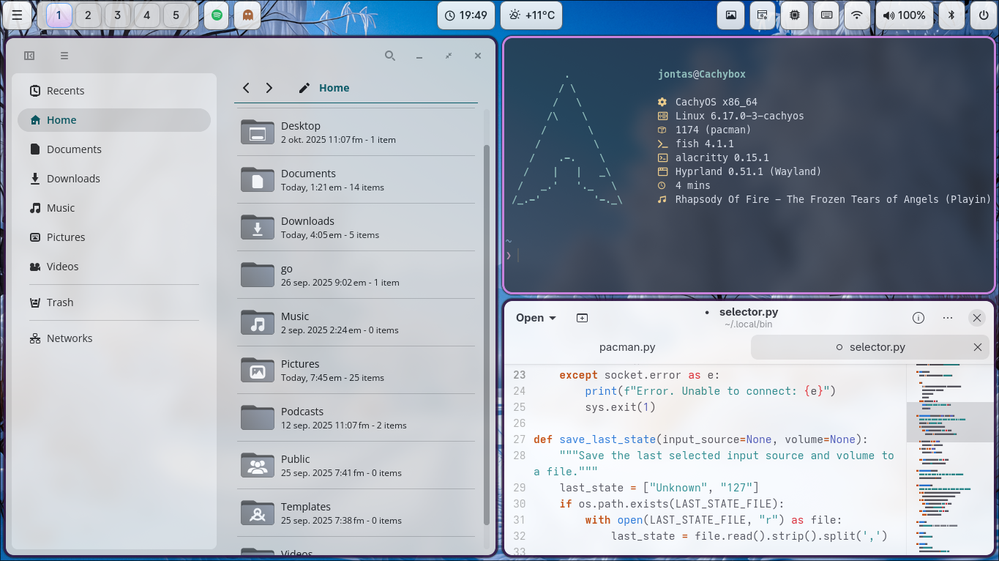

# Hyprland setup on CachyOS
## Dependencies
* Hyprland
* Hyprpaper
* Hypridle
* Hyprshots
* Hypridle
* Hyprlock
* Hyprpolkitagent
* Waybar
* Elephant
* Walker
* Mako
Elephant and Hyprpolkitagent runs as systemd services with `--user` flag. Eg. `elephant service enable` and `systemctl --user enable --now hyprpolkitagent.service`
`
## Screenshots

