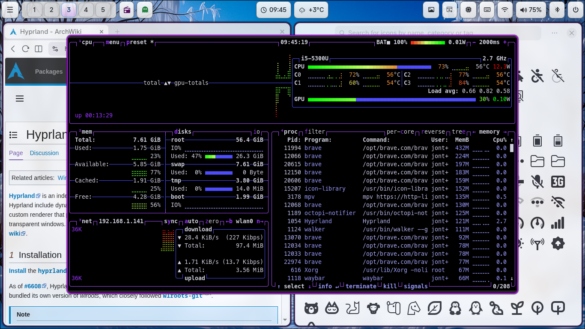

# Hyprland setup for Arch Linux
## About
A fast and light configuration without endless animations and anime stuff. No installation scripts. Review configuration files and implement the parts you like in your own config.
## Using
* [Hypr ecosystem](https://wiki.hypr.land/Hypr-Ecosystem/)
* [Waybar](https://github.com/Alexays/Waybar)
* [Elephant](https://github.com/abenz1267/elephant/)
* [Walker](https://github.com/abenz1267/walker/)
Elephant and Hyprpolkitagent runs as systemd services in userspace. Eg. `elephant service enable` and `systemctl --user enable --now hyprpolkitagent.service`
`
## Screenshots

